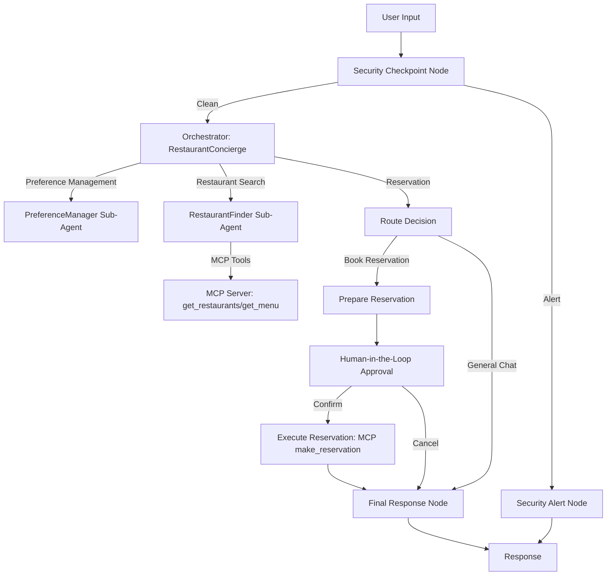

# DineOut — Agent Submission Write-Up

## Problem Statement
Dining reservations are often fragmented across multiple apps and websites. Users want a frictionless, chat-driven assistant that remembers their dietary profiles, discovers matching restaurants, and books tables securely. However, building such an assistant requires robust multi-agent orchestration, third-party integrations (like restaurant booking APIs), and strong security guardrails to protect personal information (PII) and prevent prompt injection threats.

## Solution Architecture
The DineOut agent utilizes a multi-agent workflow graph:

## Concepts Used & File References
- **ADK Workflow**: Configured in [app/agent.py](app/agent.py#L218-L233) using the ADK 2.0 graph engine with single edges.
- **LlmAgent**: Used to define the sub-agents and the orchestrator in [app/agent.py](app/agent.py#L35-L71).
- **AgentTool**: Wired in [app/agent.py](app/agent.py#L67-L68) to delegate preference analysis and restaurant discovery to sub-agents.
- **MCP Server**: Defined in [app/mcp_server.py](app/mcp_server.py) and integrated into agents using `McpToolset` in [app/agent.py](app/agent.py#L45-L69).
- **Security Checkpoint**: Implemented in [app/agent.py](app/agent.py#L87-L159) to sanitize inputs, check prompt injection keywords, limit bookings, and log events.
- **Agents CLI**: Project created using `agents-cli scaffold` and configured with `pyproject.toml` and `.env` template.

## Security Design
- **PII Scrubbing**: Cleans phone numbers, emails, and credit card details from user inputs.
- **Prompt Injection Detection**: Blocks queries containing injection keywords like `jailbreak` or `system prompt`.
- **Structured Audit Logging**: Writes every verification decision and violation to `security_audit.log` with details and severity levels.
- **Domain Policy Check**: Restricts reservations to a maximum group size of 20 to prevent abuse and coordinate large groups manually.

## MCP Server Design
The MCP server exposed in [app/mcp_server.py](app/mcp_server.py) implements three tools:
1. `get_restaurants`: Searches for restaurants with optional cuisine and price filters.
2. `get_menu`: Fetches the menu items for a specific restaurant.
3. `make_reservation`: Submits a booking request and generates a booking confirmation code.

## Human-in-the-Loop (HITL) Flow
To prevent accidental bookings and verify reservation details (restaurant, date, time, party size), the workflow includes a `request_approval` node that uses `RequestInput` to pause execution and prompt the user for confirmation. The reservation is only submitted to the MCP booking API after the user explicitly yields an approval response.

## Demo Walkthrough
1. **Search**: User requests restaurant suggestions -> `restaurant_finder` retrieves them from MCP.
2. **Booking**: User requests reservation -> orchestrator parses details -> `request_approval` prompts user -> user confirms -> table booked.
3. **Guardrails**: User attempts prompt injection -> blocked at `check_security` -> logged in `security_audit.log`.

## Impact & Value Statement
DineOut demonstrates how to build production-grade, secure, and integrated AI assistants. By using Google ADK 2.0 and MCP toolsets, it provides a safe chat interface for dining discovery and booking, serving as a template for other concierge service agents.
